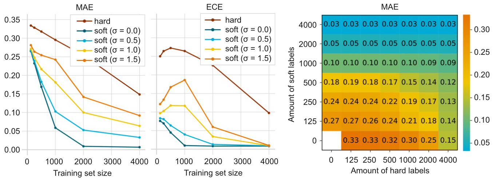
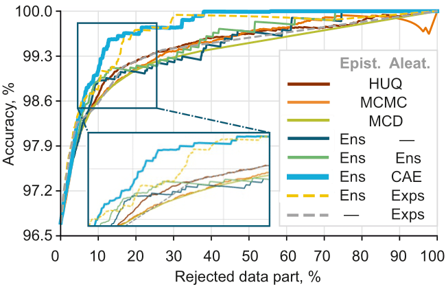
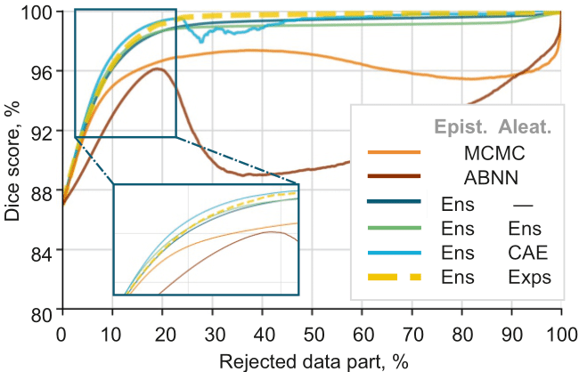
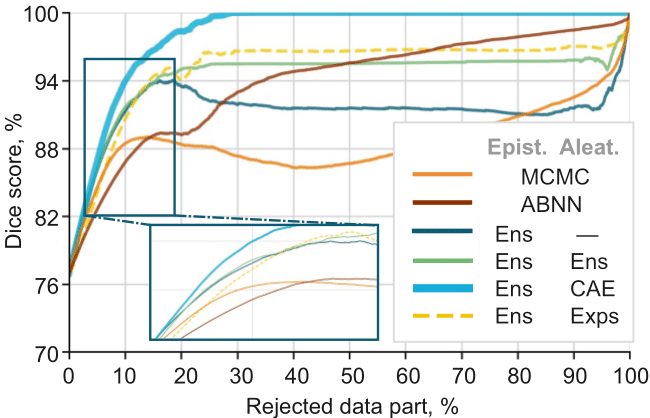
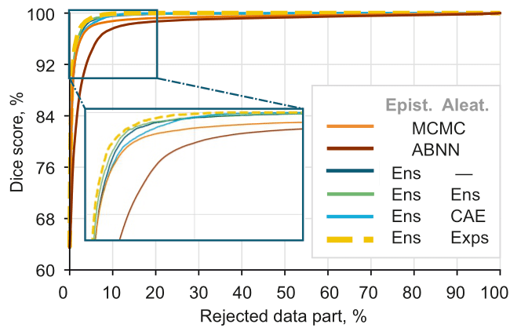

# Improving Uncertainty Estimation with Confidence-Aware Training Data
\[[pdf](https://openaccess.thecvf.com/content/WACV2025/papers/Korchagin_Improving_Uncertainty_Estimation_with_Confidence-Aware_Training_Data_WACV_2025_paper.pdf)\] \[[supp](https://openaccess.thecvf.com/content/WACV2025/supplemental/Korchagin_Improving_Uncertainty_Estimation_WACV_2025_supplemental.pdf)\] \[[data](https://zenodo.org/records/14285035)\]

Official implementation of the paper "Improving Uncertainty Estimation with Confidence-Aware Training Data" by Korchagin S. et al. The work was presented at the 2025 Winter Conference on Applications of Computer Vision.

## Abstract
AI-driven second-opinion systems play a crucial role in decision-making especially in medicine where accurate predictions guide clinicians. However quantifying uncertainty in deep learning is challenging as current methods often rely on hard class labels which do not reflect true prediction confidence. This often results in overconfident predictions and slow convergence to true probabilities. To address this we suggest a new method that separates uncertainty into two types: epistemic and aleatoric. We estimate these uncertainties using hard and soft confidence labels with experts providing confidence levels that indicate the likelihood of misclassification. We release an updated blood typing dataset consisting of 3139 images with soft labels of uncertainty annotations from six experts and hard labels collected from medical records. Proposed approach improves SotA uncertainty estimation quality by two times for blood typing (classification) and by 62% for histology (segmentation).

## Installation and Usage
The code was run on `Python 3.10`. To install all necessary dependencies, run
```
pip install -r requirements.txt
```

The code is split in three parts:
* All code and instructions to validate experiments for the blood typing task (classification) are located in the `uncertaint_classification` directory.
* All code and instructions to validate experiments for the lung CT scan segmentation and retinal fundus image segmentation tasks are located in the `segmentation` directory.
* All code and instructions to validate experiments on synthetic data will be made available soon.
* `nn` directory contains auxiliary files related to the classification task.

## Data
The blood typing BloodyWell dataset is available [here](https://zenodo.org/records/14285035). The `markup/BloodyWell` directory stores additional metadata that was used for training and testing the models.

The LIDC-IDRI and RIGA datasets are available on the internet. *TODO: add proper links.*

## Overview

### Uncertainty Decomposition via Law of Total Variance
For a an input image $x$ and a binary class label $y \in \{0, 1\}$, the uncertainty in predicting $y$ can be decomposed via the law of total variance:
$$ \mathbb{V}(y \mid x, \mathcal{D}) = \mathbb{V}_{\theta \sim \mathbb{P}(\theta \mid \mathcal{D})}[\mathbb{E}(y \mid x, \theta)] + \mathbb{E}_{\theta \sim \mathbb{P}(\theta \mid \mathcal{D})}[\mathbb{V}(y \mid x, \theta)]. $$
The first term represents epistemic uncertainty and the second term represents aleatoric uncertainty. Both terms can be approximated with an ensemble of $K$ models via Monte Carlo methods:
$$ \mathbb{V}_{\theta} [\mathbb{E}(y\mid x, \theta)] \approx \frac1K \sum_{i = 1}^K (p_{\theta_i}(x) - \overline{p_{\theta}}(x))^2, $$
$$ \mathbb{E}_{\theta}[\mathbb{V}(y \mid x, \theta)] \approx \frac1K\sum_{i = 1}^K p_{\theta_i}(x)(1 - p_{\theta_i}(x)), $$
where $\theta_i$ are parameters of the $i$-th model and $\overline{p_\theta}(x) = \frac1K \sum p_{\theta_i}(x)$.

### Confidence-based Aleatoric Uncertainty Model 
The aleatoric component can suffer from modern neural networks being overconfident in their predictions.

We propose leveraging information from multiple experts that is often available with medical data to provide soft labels $y_e$. An ensemble fine-tuned to predict such labels, which we call a **Confidence-Aware Enseble** (CAE), is then used to better approximate aleatoric uncertainty.

## Results

We test our approach first on synthetic data and then on three real-life tasks: blood typing (classification), lung CT scan segmentation (binary segmentation) and retinal fundus image segmentation (multi-class segmentation). We compare our results to various methods of uncertainty estimation.

Specific details on how we train models and produce soft labels, as well as evaluation metrics, can be found in the paper. Below is the summary of our results.

### Synthetic Data
Using soft labels allows to achieve better values of Mean Absolute Error (MAE) and Expected Calibration Error (ECE). Additionally, we show that using a mixture of hard and soft labels during training produces better MAE values compared to just hard labels.



### Blood Typing
Usage of CAEs to estimate aleatoric uncertainty significantly reduces Area Above accuracy-rejection Curve (AAC) as well as Throwaway Rate required to achieve Accuracy above 99% (TRA-99).



### Segmentation
Our approach improves AAC by **over five times** compared to only using a basic ensemble on the RIGA segmentation task. Throwaway Rate required to achieve Dice of $X$ (TRD-$X$) is also improved.




However, results on the LIDC-IDRI segmentation task show reduced performance compared to the basic approach. We hypothesize that this is due to low agreement between experts, providing high noise levels to soft labels.



## Citation
If you find our work useful, please give repository a star and cite our paper.
```
@InProceedings{Korchagin_2025_WACV,
    author    = {Korchagin, Sergey and Zaychenkova, Ekaterina and Khalin, Aleksei and Yugay, Aleksandr and Zaytsev, Alexey and Ershov, Egor},
    title     = {Improving Uncertainty Estimation with Confidence-Aware Training Data},
    booktitle = {Proceedings of the Winter Conference on Applications of Computer Vision (WACV)},
    month     = {February},
    year      = {2025},
    pages     = {7980-7990}
}
```
